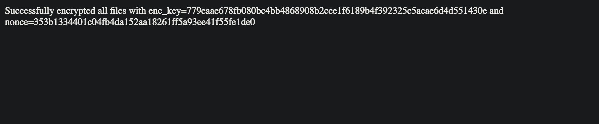

# encrypt-files-lambda

A Lambda function which takes files in one S3 bucket, encrypts them, and exports to another S3 bucket.

## Demo

You can navigate to my [currently deployed lambda instance](https://8hwnfgzqk5.execute-api.us-east-1.amazonaws.com/default/encrypt-files) and encrypt any files sitting in the S3 bucket! You won't be able to view the encrypted files, but you'll be able to see a success message like the one shown below!



## Installation

Install [Cargo Lambda](https://www.cargo-lambda.info/guide/getting-started.html) and then clone the git repo:

```bash
git clone https://github.com/hadichaudhri/encrypt-files-lambda.git
```

Create your .env file by copying `.env.example` to `.env` and configuring its environment variables.
Ensure that the lambda function has read-write access to the `BUCKET_NAME` and `ENCRYPTED_BUCKET_NAME` buckets.

## Usage

```bash
# deploy the lambda function locally
make watch

# invoke the lambda function locally
make invoke

# deploy the lambda function remotely
make deploy

# invoke the lambda function remotely
make invoke-remote
```

## Contributing

Pull requests are welcome. For major changes, please open an issue first
to discuss what you would like to change.
